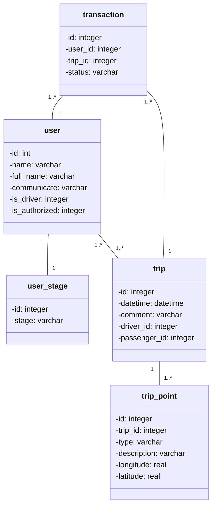

# Бот ББК ТГУ

## Первый заход в бота

### Сущности БД

**Пользователь (user)** 

| Поле          | Тип     |
| ------------- | ------- |
| id            | integer |
| name          | varchar |
| full_name     | varchar |
| communicate   | varchar |
| is_driver     | integer |
| is_authorized | integer |

**Статус (user_stage)**

| Поле  | Тип     |
| ----- | ------- |
| id    | integer |
| stage | varchar |

**Поездка (trip)**

| Поле         | Тип      |
| ------------ | -------- |
| id           | integer  |
| datetime     | datetime |
| comment      | varchar  |
| initiator_id | integer  |
| type         | varchar  |

**Точка (trip_point)**

| Поле        | Тип     |
| ----------- | ------- |
| id          | integer |
| trip_id     | integer |
| type        | varchar |
| description | varchar |
| longitude   | double  |
| latitude    | double  |

**Транзакция (transaction)**

| Поле    | Тип     |
| ------- | ------- |
| id      | integer |
| user_id | integer |
| trip_id | integer |
| status  | varchar |

### Список состояний (State)

- `not_authorized` - Начальное состояние новых пользователей
- `main` - Основное состояние бота в ожидании новой команды
- `fill_info_set_communicate` - Ожидание заполнения "Способа связи"
- `fill_info_set_is_driver` - Ожидание ответа "Водитель или Пассажир"
- `fill_info_set_car` - Ожидание заполнения "Информации о машине"
- `find_trip_set_time` - Пассажир: Заполнение времени поездки
- `find_trip_set_first` - Пассажир: Заполнение начальной точки поездки
- `find_trip_set_second` - Пассажир: Заполнение конечной точки поездки
- `find_trip_set_comment` - Пассажир: Ожидание комментария к поездке
- `create_trip_set_time` - Водитель: Заполнение времени поездки
- `create_trip_set_first` - Пассажир: Заполнение начальной точки поездки
- `create_trip_set_second` - Пассажир: Заполнение конечной точки поездки
- `create_trip_set_comment` - Водитель: Заполнение времени поездки
- ~~`edit_trip` - Изменить текущую поездку~~ (После MVP)

### Кнопки:

**Главное меню:**

Сообщение с меню отображается как `[Меню]` в колонке "Ответ бота", меню отображается при переходе в state `main`

| Текст кнопки                 | Условие                              | Next State                  |
| ---------------------------- | ------------------------------------ | --------------------------- |
| Редактировать анкету         |                                      | `fill_info_set_communicate` |
| Найти поездку                |                                      | `find_trip_set_time`        |
| Найти попутчика              | Пользователь имеет статус "Водитель" | `create_trip_set_time`      |
| Информация о текущей поездке | Создана активная поездка             | `check_trip`                |
| Список активных поездок      | Создана активная поездка             | `trip_list`                 |

**Кнопки stage = `fill_info_set_is_driver`**:

| Текст кнопки | Next State          |
| ------------ | ------------------- |
| Пассажир     | `main`              |
| Водитель     | `fill_info_set_car` |

**Кнопки stage = `check_trip`**:

| Текст кнопки                         | Next State    |
| ------------------------------------ | ------------- |
| ~~Редактировать поездку~~ (не в mvp) | ~~edit_trip~~ |
| Удалить поездку                      | `main`        |
| Назад                                | `main`        |

**Кнопки stage = `trip_list`**:

| Текст кнопки                                   | Next State  |
| ---------------------------------------------- | ----------- |
| Откликнуться *(Около каждой поездки в списке)* | `trip_list` |
| Назад                                          | `main`      |

### Переходы между состояниями

| State                                       | Сообщение пользователя                | Ответ бота                                                   | Next State                  |
| ------------------------------------------- | ------------------------------------- | ------------------------------------------------------------ | --------------------------- |
| `not_authorized`                            | /start                                | Привет, {ИМЯ}! Добро пожаловать в чат-бот Бла Бла Кар ТГУ.  Давай заполним анкету  Как другие пользователи могут с тобой связаться? Например: "@username" "вк: https://vk.com/id" "+7 9123456789" | `fill_info_set_communicate` |
| `fill_info_set_communicate`                 | [{информация для связи}]              | Отлично!   Теперь расскажи, ты водитель или только пассажир? | `fill_info_set_is_driver`   |
| `fill_info_set_is_driver`                   | [Пассажир]                            | Анкета сохранена. Ты можешь отредактировать её в любое время  [Меню] | `main`                      |
| `fill_info_set_is_driver`                   | [Водитель]                            | Опиши свою машину, чтобы попутчики тебя быстрее находили. Стоит указать марку, цвет и номер | `fill_info_set_car`         |
| `fill_info_set_car`                         | [{описание машины}]                   | Анкета сохранена. Ты можешь отредактировать её в любое время  [Меню] | `main`                      |
| `main`                                      | [Редактировать анкету]                | Давай заново заполним анкету  Как другие пользователи могут с тобой связаться? Например: "@username" "вк: https://vk.com/id" "+7 9123456789" | `fill_info_set_communicate` |
| `main`                                      | [Найти поездку]                       | Прежде чем найти поездку, давай заполним информацию о планируемой поездке  Укажи время и дату поездки в формате `ДД.ММ чч:мм` Например 1 ноября, в два часа дня: `01.11 14:00` | `find_trip_set_time`        |
| `main`  (условие: пользователь "Водитель")  | [Найти попутчика]                     | Прежде чем найти попутчика, давай заполним информацию о планируемой поездке  Укажи время и дату поездки в формате `ДД.ММ чч:мм` Например 1 ноября, в два часа дня: `01.11 14:00` | `create_trip_set_time`      |
| `main`  (условие: создана активная поездка) | [Информация о текущей поездке]        | Вот информация о планируемой поездке: Время: {Время} Откуда: {Адрес начальной точки} Куда: {Адрес конечной точки} *Комментарий: {Комментарий}* | `check_trip`                |
| `check_trip`                                | [Назад]                               | Меню: [Меню]                                            | `main`                      |
| `main` (условие: создана активная поездка)  | [Список ближайших поездок]            | Вот список ближайших поездок: {Список поездок с информацией и возможностью откликнуться}  | `trip_list`                 |
| `find_trip_set_time`                        | [{время в формате `ДД.ММ чч:мм`}]     | Теперь напиши адрес откуда ты хочешь уехать                  | `find_trip_set_first`       |
| `find_trip_set_first`                       | [{начальная точка в свободной форме}] | Теперь адрес куда ты направляешься                           | `find_trip_set_second`      |
| `find_trip_set_second`                      | [{конечная точка в свободной форме}]  | Можешь оставить комментарий к поездке, если считаешь нужным Например, если потребуется место в багажнике | `find_trip_set_comment`     |
| `find_trip_set_comment`                     | [{комментарий в свободной форме}]     | Запрос на поездку создан! Теперь ты можешь посмотреть список активных поездок [Меню] | `main`                      |
| `create_trip_set_time`                      | [{время в формате `ДД.ММ чч:мм`}]     | Теперь напиши адрес откуда начнётся поездка                  | `create_trip_set_first`     |
| `create_trip_set_first`                     | [{начальная точка в свободной форме}] | Теперь адрес конечной точки                                  | `create_trip_set_second`    |
| `create_trip_set_second`                    | [{конечная точка в свободной форме}]  | Можешь оставить комментарий к поездке, если считаешь нужным Например, количество свободных мест в машине | `create_trip_set_comment`   |
| `create_trip_set_comment`                   | [{комментарий в свободной форме}]     | Новая поездка создана! Теперь ты можешь посмотреть список активных поездок [Меню] | `main`                      |
| `trip_list`                                 | [Нажатие на кнопку отклика]           | Запрос отправлен!                                            | Смена статуса не происходит |
| `trip_list`                                 | [Назад]                               | Меню: [Меню]                                            | `main`                      |

### To-Do

- [ ] Проверять длину свободных полей (К примеру, информация для связи)
- [ ] Проверять несанкционированный ввод
- [ ] Избавиться от отдельной таблицы под stage
- [ ] Посмотреть что можно сделать с кнопкой "Дать линку"
- [ ] Редактирование поездок
- [ ] Заменить вывод "Запрос отправлен!" на редактирование кнопки

